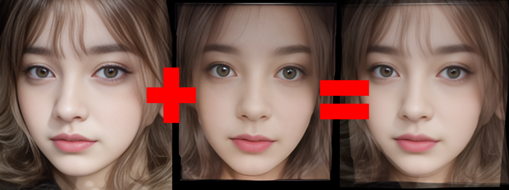
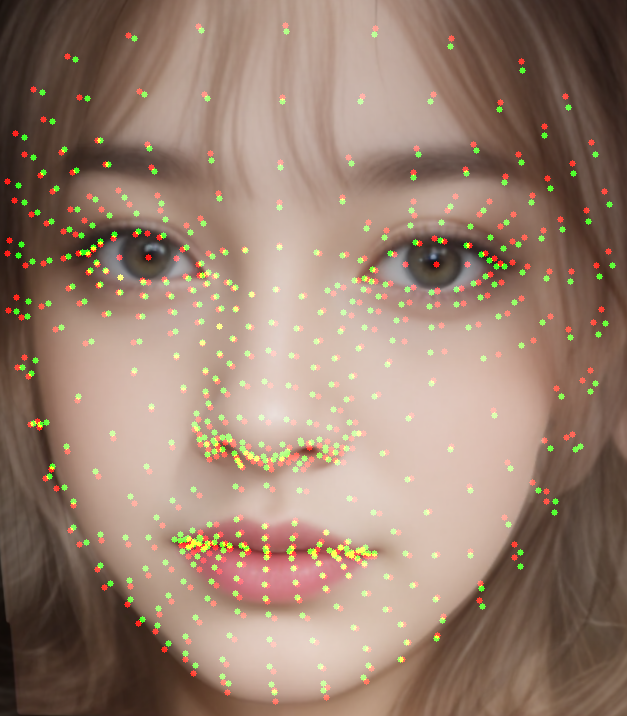
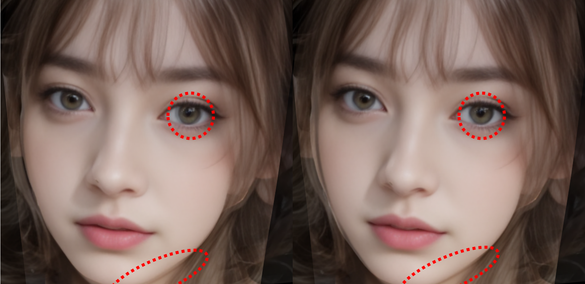

<html lang="ja">
    <head>
        <meta charset="utf-8" />
    </head>
    <body>
        <h1>
Face Morph
</h1>
        <h2>なにものか？</h2>
        

            Mediapipe Facemeshを使ってFaceMorphを書き直したものです。 
             
            Face Morph Using OpenCV ? C++ / Python  
            <a href="https://learnopencv.com/face-morph-using-opencv-cpp-python">https://learnopencv.com/face-morph-using-opencv-cpp-python</a> 
            <a href="https://raw.githubusercontent.com/spmallick/learnopencv/master/FaceMorph/faceMorph.py">https://raw.githubusercontent.com/spmallick/learnopencv/master/FaceMorph/faceMorph.py</a> 
            
        

        <h2>環境構築方法</h2>
        

            pip install mediapipe
        

        <h2>使い方</h2>
        

            python FaceMorph.py (顔画像1) (顔画像2) 
                        
            <table border="1">
                <tr><th>操作</th><th>機能</th></tr>
                <tr><td>Trackbarの移動</td><td>ブレンド比を変更してモーフィングする</td></tr>
                <tr><td>sキー押下</td><td>モーフィング結果の画像を保存する</td></tr>
                <tr><td>ESCキー押下</td><td>プログラムを終了する</td></tr>
            </table>
            python FaceMorph.py (顔画像1) 
            画像を1枚だけ指定した場合は、左右反転した画像とモーフィングします。 
             
        

        <h2>使用例</h2>
        
        <h2>その他</h2>
        <h3>Thin Plate Spline</h3>
        

            <a href="https://github.com/yoyo-nb/Thin-Plate-Spline-Motion-Model">Thin-Plate-Spline-Motion-Model</a> 
            が、かなりリアルだったので、Thin Plate Splineを使ってFaceMorphを作ってみた。 
             
            ・scikit-imageが0.24より古い場合はupgradeする。 
            　pip install --upgrade scikit-image 
            ・python src\tps_face_morph.py (画像ファイル1) (画像ファイル2) 
            　sキー押下でモーフィングした画像を保存する。 
            ・facemeshが多いとうまく変換してくれなかったので、機械的に間引いている。 
            　大事なキーポイントを選んで間引くことで多少改善するかもしれない(未確認)。 
             
            mediapipe facemesh にパラメータ refine_landmarks=True を指定すると虹彩の中心、上下左右のlandmarkが追加される。 
            その他のlandmarkの位置も若干変わる。 
             
            refine_landmarks=Trueを指定＋虹彩の中心、上下左右が間引かれな対応を実施した。 
            ・虹彩のぶれ 
            ・あご輪郭のぶれ 
            が少しだけ改善する 
            python src/tps_face_morph_refine_landmarks.py (画像1) (画像2) 
            
        

    </body>
</html>
