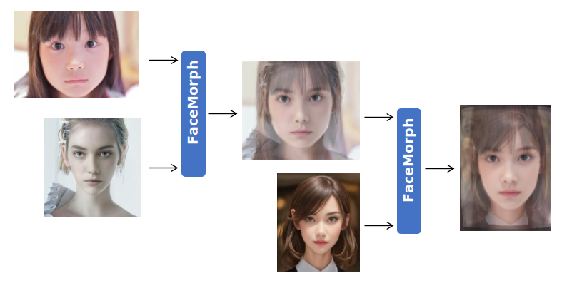

<html lang="ja">
    <head>
        <meta charset="utf-8" />
    </head>
    <body>
        <h1>
Face Morph
</h1>
        <h2>なにものか？</h2>
        

            Mediapipe Facemeshを使ってFaceMorphを書き直したものです。 
             
            Face Morph Using OpenCV ? C++ / Python  
            <a href="https://learnopencv.com/face-morph-using-opencv-cpp-python">https://learnopencv.com/face-morph-using-opencv-cpp-python</a> 
            <a href="https://raw.githubusercontent.com/spmallick/learnopencv/master/FaceMorph/faceMorph.py">https://raw.githubusercontent.com/spmallick/learnopencv/master/FaceMorph/faceMorph.py</a> 
            
        

        <h2>環境構築方法</h2>
        

            pip install mediapipe
        

        <h2>使い方</h2>
        

            python FaceMorph.py (顔画像1) (顔画像2) 
                        
            <table border="1">
                <tr><th>操作</th><th>機能</th></tr>
                <tr><td>Trackbarの移動</td><td>ブレンド比を変更してモーフィングする</td></tr>
                <tr><td>sキー押下</td><td>モーフィング結果の画像を保存する</td></tr>
                <tr><td>ESCキー押下</td><td>プログラムを終了する</td></tr>
            </table>
            python FaceMorph.py (顔画像1) 
            画像を1枚だけ指定した場合は、左右反転した画像とモーフィングします。 
             
        

        <h2>使用例</h2>
        
    </body>
</html>
